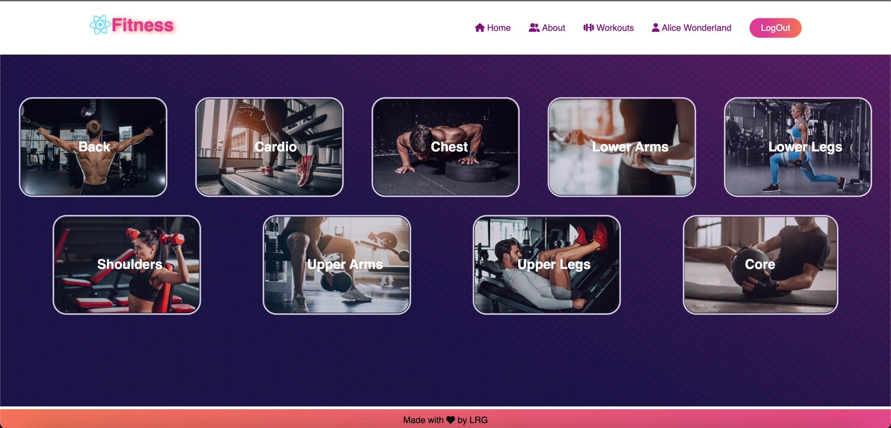
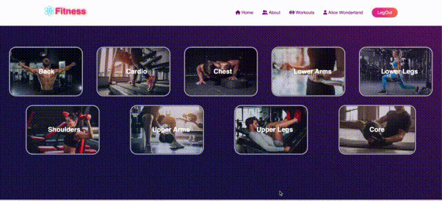

# React Fitness

Welcome to React Fitness. With more than 1000 exercises to choose from, you can custom build your workout routine. 

You can also track your progress by logging your workout sessions.
#

## Tech Stack:

### Front End:
* [React](https://reactjs.org)
* [SASS](https://sass-lang.com)
* [Axios](https://axios-http.com)


#### FrontEnd Dependencies:
* [classnames](https://www.npmjs.com/package/classnames)
* [dotenv](https://www.npmjs.com/package/dotenv)
* [framer-motion](https://www.framer.com/motion/)
* [react router DOM](https://reactrouter.com/)
* [node-SASS](https://www.npmjs.com/package/node-sass)


#

### Back End:
* [Node.JS](https://nodejs.org)
* [ExpressJS](https://expressjs.com)

#### BackEnd Dependencies:
* [body-parser](https://www.npmjs.com/package/body-parser)
* [CORS](https://www.npmjs.com/package/cors)
* [helmet](https://www.npmjs.com/package/helmet)
* [nodemon](https://www.npmjs.com/package/nodemon)


#

### Database: 
* [PostgreSQL](https://postgresql.org)

#

## Setup: 
FrontEnd and BackEnd have separate dependencies that needs to be installed. To install them separately:

* Go to react-front-end folder
  ```
  cd react-front-end/
  ```
  Then run npm install
  ```
  npm install
  ```
  
# 

* Go to express-back-end folder
  ```
  cd express-back-end
  ```
  Then run npm install
  ```
  npm install
  ```
# 
## Main Window:

# 
## Sample Navigation:
Here is a sample navigation on creating your own workout


